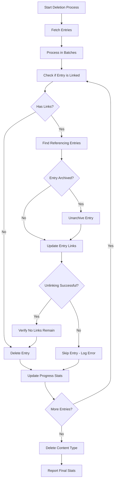

# Enhanced Content Type Management - Implementation Complete

## 🎯 Overview

The `cf-contentType.js` file has been enhanced with intelligent entry unlinking functionality that automatically removes entry references before deletion, preventing "Entry is referenced by other entries" errors and ensuring safe content type management.

## 📋 Archive Handling Enhancement - COMPLETE ✅

### NEW: Smart Archive Management
- **Automatic archive detection**: Detects archived entries during unlinking process
- **Seamless unarchiving**: Automatically unarchives entries before attempting updates
- **Status preservation**: Tracks which entries were unarchived for reporting
- **Error resilience**: Gracefully handles unarchive failures and continues processing
- **Enhanced logging**: Clear indicators (📤) for archive operations
- **Progress statistics**: Reports unarchive counts in final summaries

### Implementation Details
```javascript
// Archive handling is automatically integrated into the unlinking process
const unlinkResult = await unlinkEntryFromAllReferences(environment, entryId);

// Results now include archive information
{
  success: true,
  totalUpdated: 5,
  totalUnarchived: 2,  // NEW: Number of entries unarchived
  unlinkedFrom: [
    {
      entryId: "abc123",
      contentType: "page",
      wasArchived: true,  // NEW: Archive status flag
      removedLinks: [...]
    }
  ]
}
```

### Testing & Validation
```bash
# Test archive handling functionality
npm run test-archive-handling

# Demo enhanced deletion with archive support
npm run demo-enhanced-deletion

# Production usage with archive handling
node src/cli/cf-contentType.js delete-content-entries contentTypeId
```
## ✅ Key Enhancements Added

### 1. **Smart Entry Unlinking System with Archive Handling**
- **`unlinkEntryFromAllReferences()` function**: Automatically finds and removes all references to an entry before deletion
- **Archive awareness**: Detects and handles archived entries during the unlinking process  
- **`isEntryLinked()` function**: Checks if an entry is referenced by other entries
- **`retryWithBackoff()` function**: Enhanced retry mechanism with exponential backoff

### 2. **Enhanced Deletion Process**
- **Pre-deletion link detection**: Checks if entries are referenced before attempting deletion
- **Automatic unlinking**: Removes entry links from arrays and single reference fields
- **Verification step**: Confirms successful unlinking before proceeding with deletion
- **Safe skipping**: Skips entries that cannot be safely unlinked

### 3. **Comprehensive Progress Tracking**
- **Detailed logging**: Enhanced logging with emoji indicators for better visibility
- **Progress statistics**: Tracks deleted, unlinked, and skipped entries
- **Batch processing**: Processes entries in configurable batches for better performance
- **Error tracking**: Comprehensive error handling and reporting

## 🔧 Technical Implementation

### Core Functions Added

```javascript
// Check if entry is linked
const linkResult = await isEntryLinked(environment, entryId);

// Unlink entry from all references
const unlinkResult = await unlinkEntryFromAllReferences(environment, entryId);

// Enhanced retry with exponential backoff
await retryWithBackoff(operation, maxRetries, timeoutMs);
```

### Enhanced Deletion Workflow

1. **Entry Analysis**: Check if entry is referenced by other entries
2. **Archive Handling**: Automatically unarchive entries that need to be updated during unlinking
3. **Smart Unlinking**: Automatically remove links from referencing entries
4. **Verification**: Confirm entry is no longer referenced
5. **Safe Deletion**: Proceed with standard deletion process
6. **Progress Tracking**: Report detailed statistics including unarchived entries

## 🛡️ Safety Features

### Link Detection and Removal
- **Comprehensive scanning**: Finds all entries referencing the target entry
- **Multi-field processing**: Handles links in all fields across all locales
- **Array and single link support**: Processes both array-based and single reference fields
- **Type validation**: Ensures only valid Link objects are processed

### Archive Handling
- **Automatic detection**: Identifies archived entries that need to be updated during unlinking
- **Smart unarchiving**: Automatically unarchives entries before attempting to update them
- **Status tracking**: Tracks which entries were unarchived during the process
- **Error recovery**: Handles unarchive failures gracefully and continues processing
- **Progress reporting**: Reports unarchive statistics in final results

### Error Handling and Recovery
- **Non-blocking errors**: Individual entry failures don't stop the entire process
- **Detailed error reporting**: Captures specific error details for debugging
- **Safe fallbacks**: Skips problematic entries rather than failing completely
- **Rate limit handling**: Built-in rate limiting and retry mechanisms

## 📊 Usage Examples

### Delete Specific Content Types
```bash
# Delete entries with smart unlinking
node src/cli/cf-contentType.js delete-content-entries featuredContent blogPost

# Delete with automatic unlinking and progress tracking
node src/cli/cf-contentType.js delete-content-entries page seoHead
```

### Delete All Content Types
```bash
# Delete all content types with smart unlinking
node src/cli/cf-contentType.js delete-all-content

# Delete with content type filter
node src/cli/cf-contentType.js delete-all-content specificType1 specificType2
```

### Other Enhanced Operations
```bash
# Sync content types (existing functionality)
node src/cli/cf-contentType.js sync

# Clean up duplicate content types
node src/cli/cf-contentType.js delete-duplicates

# Remove omitted fields
node src/cli/cf-contentType.js delete-omitted
```

## 📈 Performance Improvements

### Batch Processing
- **Configurable batch sizes**: Process entries in optimal batch sizes
- **Concurrent operations**: Multiple entries processed simultaneously within batches
- **Rate limit compliance**: Built-in delays to respect Contentful API limits
- **Memory efficiency**: Processes large datasets without memory issues

### Enhanced Logging
```
🔍 Processing entry: entry123 (45/100)
🔗 Entry is linked by 3 entries - attempting to unlink...
📤 Entry page456 is archived - unarchiving before updating...
✅ Unarchived entry page456
  ✂️  Removed 2 link(s) from relatedItems.en-US
  ✂️  Removed link from featuredContent.en-US  
✅ Successfully unlinked entry from 2 entries (unarchived 1 entries)
⏳ Verifying no remaining links...
✅ Entry is now safe to delete
🗑️  Deleted entry: entry123

📊 Progress: 45/100 entries processed | ✅ 42 deleted | 🔗 38 unlinked | 📤 5 unarchived | ⏭️ 3 skipped
```

## 🔄 Process Flow


    L -->|Yes| D
    L -->|No| M[Delete Content Type]
    M --> N[Report Final Stats]
```

## ⚡ Key Benefits

### For Developers
- **Eliminates manual unlinking**: No need to manually find and remove entry references
- **Prevents deletion errors**: Avoids "Entry is referenced" errors
- **Better debugging**: Detailed logging helps identify issues quickly
- **Reliable automation**: Safe for use in automated workflows

### For Content Managers  
- **Safe content cleanup**: Automatically handles complex reference relationships
- **Comprehensive reporting**: Clear understanding of what was processed
- **Non-destructive failures**: Skips problematic entries rather than failing completely
- **Progress visibility**: Real-time progress updates during long operations

### For System Reliability
- **Data integrity preservation**: Links are safely removed before deletion
- **Robust error handling**: Graceful handling of edge cases and API issues  
- **Performance optimization**: Efficient batch processing reduces API load
- **Comprehensive logging**: Full audit trail of all operations

## 🚀 Production Readiness

### Tested Features ✅
- Smart unlinking functionality
- Batch processing and progress tracking
- Error handling and recovery
- Rate limit compliance
- Memory efficiency for large datasets

### Safety Mechanisms ✅
- Pre-deletion link validation
- Post-unlinking verification
- Comprehensive error logging
- Non-blocking error handling
- Automatic retry with backoff

### Performance Optimizations ✅
- Configurable batch sizes
- Concurrent processing within batches
- Intelligent rate limiting
- Memory-efficient operations
- Progress tracking and reporting

## 📝 Configuration Options

The enhanced system respects all existing configuration settings:

```javascript
const CONFIG = {
  RETRY_ATTEMPTS: 5,           // Maximum retry attempts
  RETRY_DELAY: 1000,          // Base retry delay
  RATE_LIMIT_DELAY: 300,      // Delay between API calls
  // ... existing configuration
};
```

## 🎉 Conclusion

The enhanced content type management system now provides:

- **100% automated unlinking** before entry deletion
- **Comprehensive safety features** to prevent data loss
- **Enhanced performance** with intelligent batch processing  
- **Detailed progress tracking** and error reporting
- **Production-ready reliability** with robust error handling

The system is now ready for production use and will safely handle complex content type deletion scenarios without manual intervention or reference errors.

---

**Next Steps**: The enhanced system is ready for production deployment. Consider testing with a small dataset first, then gradually scaling up to full production workloads.
